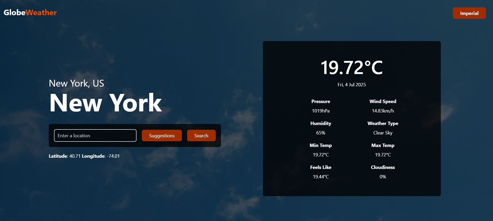

# GlobeWeather

**GlobeWeather** is a modern, accessible weather web application that allows users to search for any city worldwide and view real-time weather data in either Metric or Imperial units.



## Features

- **Location search with autocomplete suggestions**: Find any city worldwide quickly and easily.
- **Real-time weather data**: View up-to-date temperature, wind speed, humidity, and more.
- **Dynamic backgrounds**: Background visuals change based on current weather conditions.
- **Unit toggle** Switch seamlessly between metric and imperial measurement systems
- **Keyboard navigation & screen reader support**: Fully accessible, following [WCAG 2.1 AA accessibility standards](https://www.w3.org/TR/WCAG21/), achieving a **Lighthouse accessibility score of 100**.
- **Responsive design**: Optimised for desktop, tablet, and mobile devices.

## Tech Stack

- **React** with **TypeScript**
- **Redux Toolkit**
- **Tailwind CSS**
- **OpenWeatherMap API**

## Installation

1. **Clone this repo:**

   ```bash
   git clone https://github.com/TerenceCLZhang/GlobeWeather-website.git
   cd GlobeWeather-website
   ```

2. **Install dependencies:**

   ```bash
   npm install
   ```

3. **Set up environment variables:**

   Create a `.env` file in the root directory with the following

   ```ini
   VITE_OPENWEATHER_API_KEY=your_openweather_api_key
   ```

4. **Start the development server:**

   ```bash
   npm run dev
   ```

## Contributions

This is a personal project created to showcase my skills. I am not accepting contributions at this time.

## License

This project is released under the [MIT license](LICENSE). You are free to use, modify, and distribute this project in accordance with the terms of the license.
